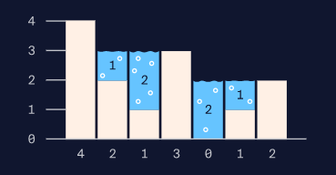

<h1>Capturing Rainwater</h1>

Create a capturingRainwater() method that takes in an array of heights, and returns the amount of rainwater that could be contained in that array.

For example, the array [4, 2, 1, 3, 0, 1, 2] can be represented in the following histogram:

As you can see, there are 6 units of water that can be contained, so calling capturing_rainwater() on the array [4, 2, 1, 3, 0, 1, 2] should return 6.